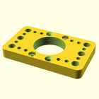
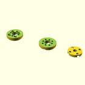
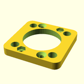

# OOBB Production File Summary for OOBB Holder For a NEMA 17 Stepper Motor (5x3)
OOBB Holder For a NEMA 17 Stepper Motor (5x3)
## files

*  3dpr_1.stl  - Main - Main holder piece  
*  3dpr_2.stl  - Shaft Adapter - Shaft adapter  
*  3dpr_3.stl  - Bearing - Holder for the 6705 bearing  
*  3dpr_4.stl  - Bearing - Holder for the 6705 bearing  
